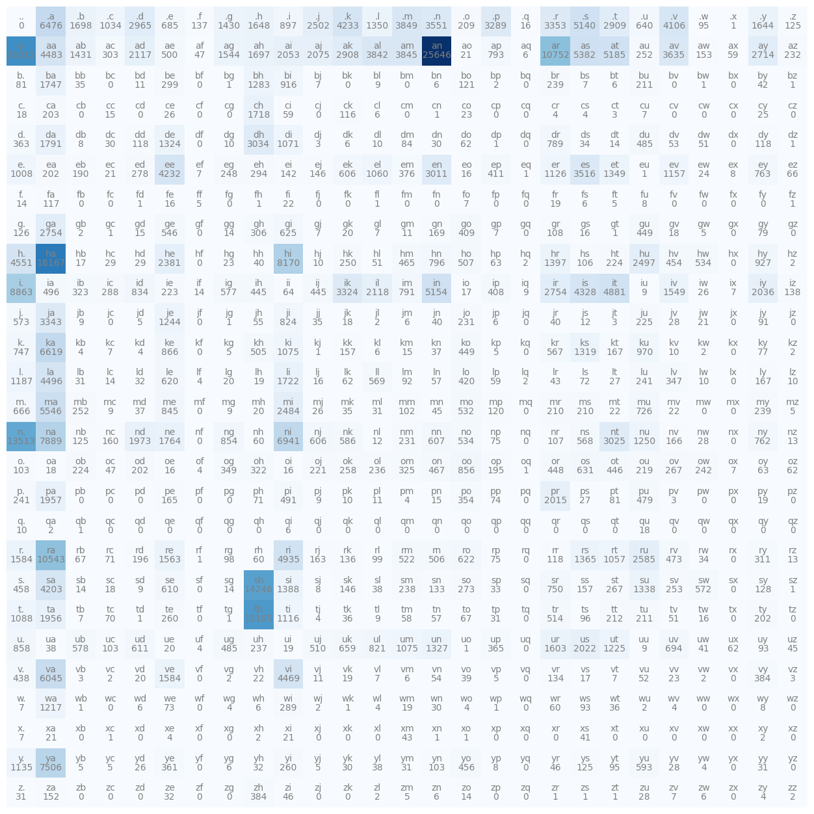
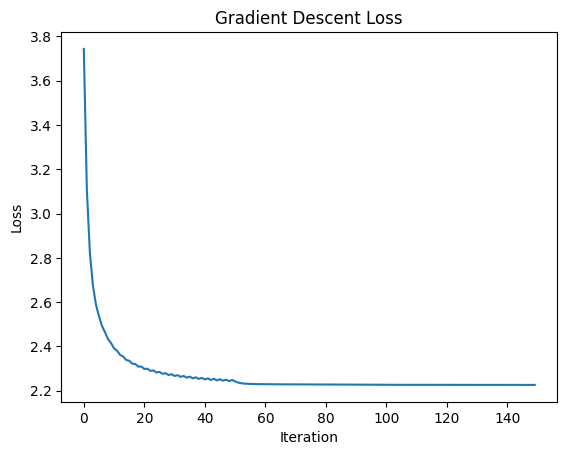
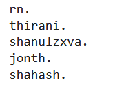
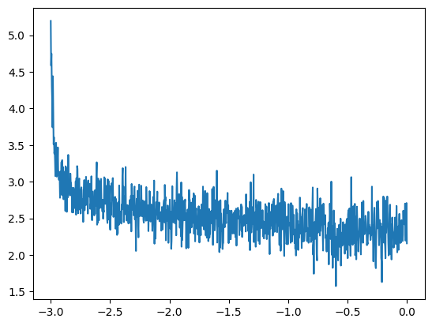
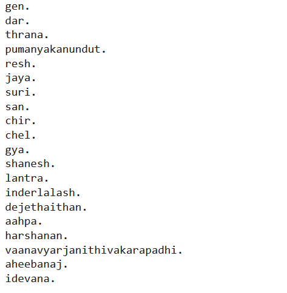

# MAKEMORE: Building a Character-Level Language Model from Scratch  
*By Lakshit Sethia - 210102123 - DA623*

---

## Motivation

After spending considerable time working on CNNs, I wanted to transition into the world of NLP. Language modeling, specifically autoregressive character-level bigram model, was a good start as it was covered in the course material.

This project allowed me to build a model from scratch using PyTorch and train a model capable of generating Indian names.

---

## What I Learned

### Key Concepts Covered
- understanding of **broadcasting** in PyTorch.
- full **language modeling pipeline** — from training on character sequences to sampling coherent names.
- learned how to evaluate models using **log-likelihood and negative log likelihood (NLL)**.

### Practical Skills Developed
- **manual implementation of neural network layers**, giving better understanding of the backpropagation process.
- **model training techniques** such as batching, gradient descent, and mini-batch sampling.
- **learning rate tuning**, including exponential sweep and scheduled adjustments.
- fine-tuned **hyperparameters** (context size, hidden layer width).


---

## Code Overview

### 1. Bigram Count Model
A bigram frequency model is created by analyzing the character transitions from a dataset of Indian names.

- **Bigram Frequency Heatmap**  
  

- **Sampling Example**  
  ```python
  while True:
      p = P[ix]
      ix = torch.multinomial(p, num_samples=1).item()
      out.append(itos[ix])
      if ix == 0: 
          break
  ```
- **Mean NLL:** ~2.02

### 2. Bigram Neural Net (Single-Layer MLP)
An MLP is trained using one-hot character vectors as input and a single layer of weights to predict the next character.

```python
xenc = F.one_hot(xs, num_classes=27).float()
logits = xenc @ W
probs = F.softmax(logits, dim=1)
loss = -probs[torch.arange(len(ys)), ys].log().mean()
```

- **Loss Curve**  
  

- **Generated Samples**  
  

- **Mean NLL:** ~2.22

### 3. Multilayer Perceptron with Context
Instead of using only one previous character, the MLP is extended to take three characters of context.

```python
emb = C[X]
h = torch.tanh(emb.view(-1, context_size * embedding_dim) @ W1 + b1)
logits = h @ W2 + b2
loss = F.cross_entropy(logits, Y)
```

- **Learning Rate Tuning**  
  

- **Final Training Loss:** ~1.94 
- **Dev Loss:** ~1.96

- **Sample Outputs**  
  

---

## Reflections

### What Surprised Me?
- Even basic bigram models, when trained carefully, can produce surprisingly realistic name-like outputs.
- Neural Network kind-of tended to fit to bigram model only after gradient descent.
- Subtle bugs like incorrect indexing or broadcasting in PyTorch can completely derail training.

### Scope for Improvement
- Proper initialization of weights instead of random.
- Trying out different activations other than `tanh`.
- Extend the model to use word or subword tokens.
- Replace MLP with a transformer encoder/decoder.

---

## References

- 🧠 Andrej Karpathy’s [makemore repo](https://github.com/karpathy/makemore) and youtube lectures.
- 📄 Bengio, Yoshua et al. "[A Neural Probabilistic Language Model](https://www.jmlr.org/papers/volume3/bengio03a/bengio03a.pdf)", 2003.
- 🎓 Lecture slides on Bigram models (slides by course material - DA623 IITG)
- 🗃️ Indian name datasets from Kaggle:
  - [Dataset 1](https://www.kaggle.com/datasets/ananysharma/indian-names-dataset)
  - [Dataset 2](https://www.kaggle.com/datasets/jasleensondhi/indian-names-corpus-nltk-data)
  - [Dataset 3](https://www.kaggle.com/datasets/shubhamuttam/indian-names-by-gender)

---

> “To understand large models, you must first build small ones.” – Inspired by Karpathy
